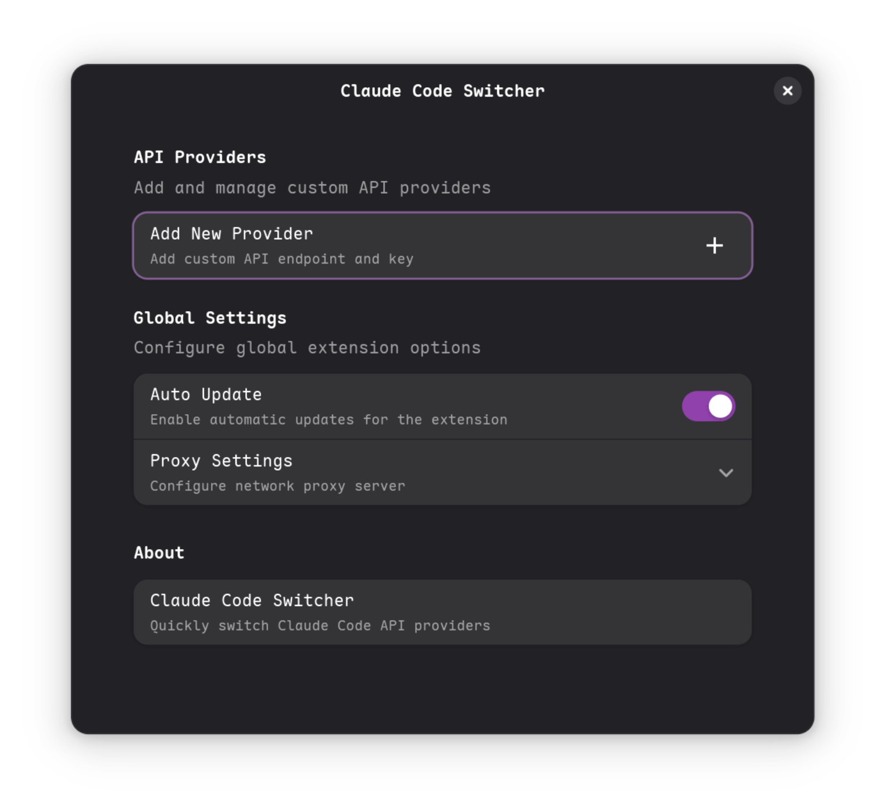
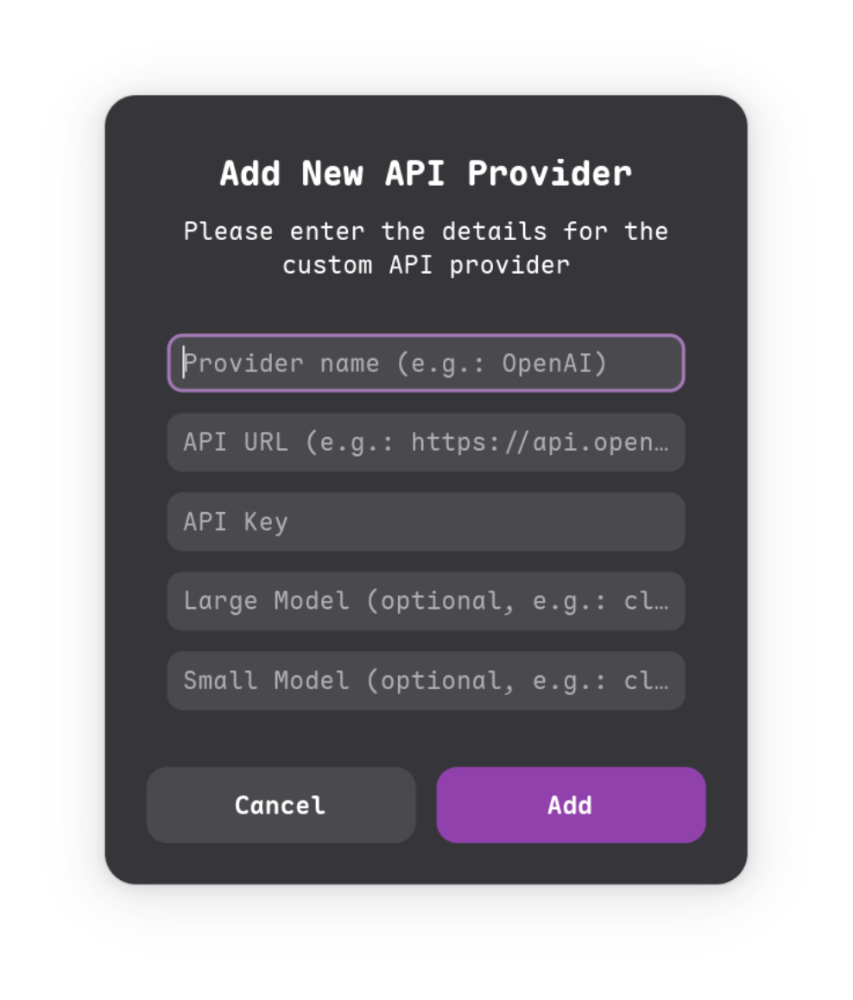

# Claude Code Switcher

[中文](/README_CN.md)

A GNOME Shell extension for quickly switching Claude Code API providers.




## Features

- Quick provider switching from the top panel
- Support for Anthropic-compatible API providers
- Easy configuration through GNOME Settings
- Local sync with `~/.claude/settings.json`
- Proxy and auto-update settings
- Model size configuration
- Task progress notifications
- Telegram bot integration for remote notifications
- Session history viewer with detailed conversation logs
- API usage statistics and cost tracking

## Installation

### From GNOME Extensions Website
Install directly from [extensions.gnome.org](https://extensions.gnome.org/extension/8424/claude-code-switcher/)

### Manual Installation
1. Navigate to extensions directory:
   ```bash
   cd ~/.local/share/gnome-shell/extensions
   ```
2. Clone this repository:
   ```bash
   git clone https://github.com/nsjsv/claude-code-switcher.git claude-code-switcher@nsjsv.github.io
   ```
3. Restart GNOME Shell (Alt+F2, type `r`, press Enter)
4. Enable the extension in Extensions app

## Usage

1. Click the extension icon in the top panel
2. Select your desired provider from the dropdown menu
3. Click "Add more..." to configure additional providers

## Configuration

Open the extension preferences to:
- Add new Anthropic-compatible API providers
- Configure provider settings (API keys, models, etc.)
- Set up proxy settings
- Enable auto-update features
- Configure task completion and interruption notifications
- Set up Telegram bot for remote notifications
- View session history and conversation details
- Monitor API usage statistics and costs

## API Requirements

This extension requires API providers that are compatible with Anthropic's API format. The API endpoints must follow Anthropic's request/response structure.

## Supported Providers

- Anthropic Claude (official)
- Any API provider compatible with Anthropic's API format

## Requirements

- GNOME Shell 45+ (supports versions 45, 46, 47, 48)
- Claude Code CLI tool

## Development

This extension is built using:
- GJS (GNOME JavaScript)
- Adwaita UI components
- GSettings for configuration storage

## License

This project is licensed under the GPL-3.0 License - see the [LICENSE](LICENSE) file for details.

## TODO

- [ ] Optimize and enhance session history viewer
- [ ] Add more notification methods
- [ ] Optimize dashboard interface
- [ ] Export and import settings functionality
- [ ] Add session search and filtering capabilities

## Contributing

Feel free to submit issues and pull requests to improve this extension.