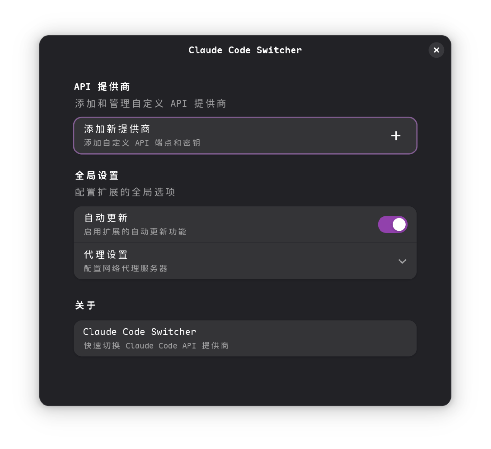
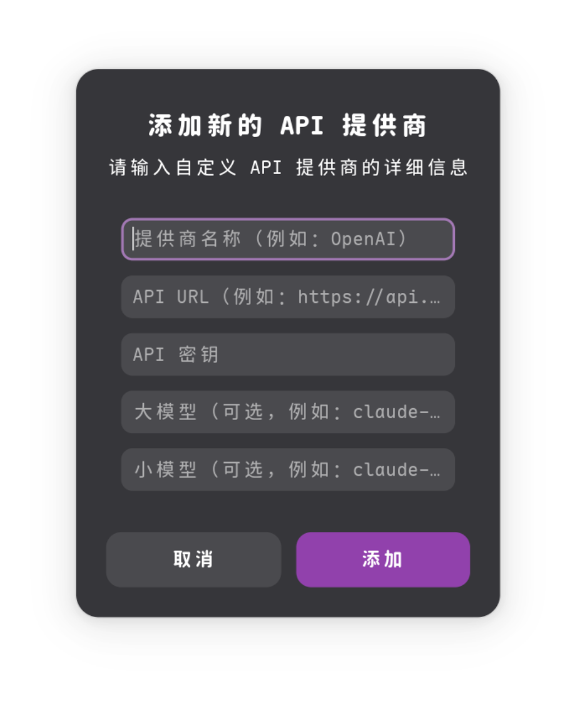

# Claude Code Switcher

一个用于快速切换 Claude Code API 提供商的 GNOME Shell 扩展。




## 功能特性

- 从顶部面板快速切换提供商
- 支持 Anthropic 兼容的 API 提供商
- 通过 GNOME 设置轻松配置
- 与 `~/.claude/settings.json` 本地同步
- 代理和自动更新设置
- 模型大小配置

## 安装

### 从 GNOME 扩展网站安装
直接从 [extensions.gnome.org](https://extensions.gnome.org/extension/8424/claude-code-switcher/) 安装

### 手动安装
1. 进入扩展目录：
   ```bash
   cd ~/.local/share/gnome-shell/extensions
   ```
2. 克隆此仓库：
   ```bash
   git clone https://github.com/nsjsv/claude-code-switcher.git claude-code-switcher@nsjsv.github.io
   ```
3. 重启 GNOME Shell（Alt+F2，输入 `r`，按回车）
4. 在扩展应用中启用此扩展

## 使用方法

1. 点击顶部面板中的扩展图标
2. 从下拉菜单中选择所需的提供商
3. 点击"添加更多..."来配置额外的提供商

## 配置

打开扩展首选项可以：
- 添加新的 Anthropic 兼容 API 提供商
- 配置提供商设置（API 密钥、模型等）
- 设置代理配置
- 启用自动更新功能

## API 要求

此扩展需要与 Anthropic API 格式兼容的 API 提供商。API 端点必须遵循 Anthropic 的请求/响应结构。

## 支持的提供商

- Anthropic Claude（官方）
- 任何与 Anthropic API 格式兼容的提供商

## 系统要求

- GNOME Shell 48+
- Claude Code CLI 工具

## 开发

此扩展使用以下技术构建：
- GJS (GNOME JavaScript)
- Adwaita UI 组件
- GSettings 用于配置存储

## 许可证

此项目采用 GPL-3.0 许可证 - 详情请查看 [LICENSE](LICENSE) 文件。

## 贡献

欢迎提交问题和拉取请求来改进此扩展。